# DAP

Digital Asset Platform with Privacy Preserving Data Management by Keyban


[](https://www.keyban.io)

## Overview

The DAP (Digital Asset Platform) project aims to integrate digital assets into various business applications seamlessly. This platform leverages blockchain technology to provide secure, scalable, and user-friendly solutions for managing digital assets, including cryptocurrencies, tokens, and digital passports. The project includes developing multiple components, such as SDKs, user interfaces, and backend services to support various use cases.

## Table of Contents

* [Installation](#installation)
* [Quick Start](#quick-start)
* [Wallet Stories](#wallet-stories)
* [Hedera Stories](#hedera-stories)
* [Architecture](#architecture)
* [Collaboration](#collaboration)

## Installation

### Prerequisites

* Docker >= 25.0.5
* CLK >= 0.36.0

### Install brew

```bash
/bin/bash -c "$(curl -fsSL https://raw.githubusercontent.com/Homebrew/install/HEAD/install.sh)"
```

### CLK

Install CLK

```bash
curl -sSL https://clk-project.org/install.sh | env CLK_EXTENSIONS=k8s bash
```

Verify CLK version

```bash
clk --version
```

Install k8s extension to CLK

```bash
clk extension install k8s
```

Install [pre-commit](https://pre-commit.com/) for git hooks resolution (optional)

From root of the project:

``` bash
tools/setup-hooks.sh
```

## Quick Start

Boot the k8s

```bash
clk k8s flow
```

Start the stack

```bash
tilt up
```

Stop the stack

```bash
tilt down
```

Connect to the documentation over https://keyban.localtest.me/doc

## Wallet Stories

The Wallet Stories section focuses on the development of components and features related to cryptocurrency wallets. These include secure key storage solutions, user authentication modules, transaction handling, and various UI components.

### Components and Features

* **C4 Model**
* **ECDSA TSS MPC React Signer**
  * React Component for Browser Unsafe Key Storage Solution
  * React Component for Smartphone Unsafe Key Storage Solution
  * React Component for Smartphone Native Key Storage Solution
* **Unified Error Handling**
* **Zero Trust Architecture**
* **React Wallet SDK Setup**
* **React Account Listing Component**
* **React User Authentication Module (parent: OAuth2 Support)**
* **SDK Documentation Hub**
* **Quick Start Guides**
* **FAQs and Troubleshooting**
* **Application Definition Interface - Admin Portal**
* **React KMS Integration for Secure Data Storage**
* **Smart Account Contract**
* **Gas-Less Transaction via Gas Sponsoring**
* **React Native Balance Display**
  * React Non-Native Balance Display
  * React Token Balance Display & Token Details
* **React Native Cryptocurrency Send Component**
* **React Token Send Component (Non-native Tokens)**
* **React Pending Transactions History Component**
* **React Received Transactions History Component**
* **React Notification for Incoming and Outgoing Cryptocurrency Transactions**
* **React Sent Transactions History Component**
* **React Network Selection Component**
* **Signer Operation Benchmarking**
* **Pen Testing**
* **SOC 2 Certification**
* **Service SLA Features**
* **Real-Time Platform Status Page**
* **Operational Cost Management for Infrastructure and Services**
* **React Component for Google Drive Wallet Data Storage**

## Hedera Stories

The Hedera Stories section includes various use cases focused on integrating the Hedera network with the DAP platform. These use cases highlight how the platform can be utilized for logistics traceability, data monetization, and more.

### Use Cases

* **UC1: Wallet and DPP Association**
* **UC2: Logistics Traceability**
* **UC3: Repairing Log**
* **UC4: Second Hand Market**
* **UC5: Recycling / End of DPP Lifecycle**
* **UC6: Data Monetization**
* **UC7: Retargeted Promotional Offer**

## Architecture

### Decision Records

They are stored in `./docs/adr` and are edited using [adr-tools](https://github.com/npryce/adr-tools).

### Introduction to the System Architecture Diagram for Account and Transaction Management on Hedera and Polygon Networks

This diagram provides a comprehensive overview of the system architecture designed to manage accounts and transactions within the Hedera and Polygon blockchain environments. It highlights key components and interactions that support the end-to-end processes of account management, including the creation, monitoring, and handling of both native and non-native transactions.

The architecture is segmented into various subgraphs, each detailing a specific aspect of the system:

* **React**: Focuses on the frontend interactions within the system, showcasing components like React Wallet which interfaces with both Hedera and Polygon accounts.
* **Hedera and Polygon Subgraphs**: These sections illustrate the specific functionalities provided by the Hedera and Polygon networks, including account creation, balance management, and transaction history, along with detailed transaction processes like crypto and token transfers.
* **Auth**: This subgraph details the authentication services integrated into the system, such as OAuth2, Auth0, and Amazon Cognito, which ensure secure user access and identity management.
* **Key Storage**: Explores various key storage solutions that support secure key management across different platforms including web browsers and smartphones, highlighting both generic and specific storage options like Google Drive, Apple iCloud, and native smartphone storage.

```mermaid
graph LR
    %% Define styles
    classDef react fill:#61dafb,stroke:#000,stroke-width:2px, color:#000;
    classDef hedera fill:#ff9f00,stroke:#000,stroke-width:2px, color:#000;
    classDef polygon fill:#8247e5,stroke:#000,stroke-width:2px, color:#fff;
    classDef auth fill:#5a45ff,stroke:#000,stroke-width:2px, color:#fff;
    classDef keyStorage fill:#2db7f5,stroke:#000,stroke-width:2px, color:#000;
    classDef transfers fill:#f962b1,stroke:#000,stroke-width:2px, color:#000;
    classDef accounts fill:#77b255,stroke:#000,stroke-width:2px, color:#000;
    classDef selected fill:#e91e63,stroke:#000,stroke-width:2px, color:#000;

    EdDSAMPCTSSSigner("EdDSA MPC TSS Signer")
    EcDSAMPCTSSSigner("EcDSA MPC TSS Signer")

    %% React Subgraph
    subgraph React
        ReactWallet("React Wallet")
        ReactHederaAccounts("React Hedera Accounts")
        ReactPolygonAccounts("React Polygon Accounts")
    end

    %% Hedera Subgraph
    subgraph Hedera
        ReactHederaAccountsCreate("Create an EOA Account")
        ReactHederaAccountsList("Account List")
        ReactHederaNetwork("Hedera Network selection")
        ReactHederaAccountNotifier("Incomes/Outcomes Notifier")
        ReactHederaAccount("Account")
        HederaGetAccount("Get Account")
        ReactHederaAccountsBalance("Balance")
        ReactHederaAccountsBalanceNative("Native")
        ReactHederaAccountsBalanceNonNative("Non Native")
        ReactHederaAccountsBalanceToken("Token")
        ReactHederaAccountsBalanceTokenDetail("Token details")
        ReactHederaAccountsTransactionHistory("Transaction history")
        ReactHederaProvider("Hedera Provider")
        subgraph HederaTransfer
            HederaTransferCrypto("Transfer Crypto (Native/Non-Native)")
            HederaTransferToken("Transfer Token")
            HederaTransferFeeEstimation("Transfer Fee Estimation")
        end
    end

    %% Polygon Subgraph
    subgraph Polygon
        ReactPolygonAccountsCreate("Create a Smart Account")
        ReactPolygonAccountsList("Account List")
        ReactPolygonNetwork("Polygon Network selection")
        ReactPolygonAccountNotifier("Incomes/Outcomes Notifier")
        ReactPolygonAccount("Account")
        ReactPolygonAccountsBalance("Balance")
        ReactPolygonAccountsBalanceNative("Native")
        ReactPolygonAccountsBalanceNonNative("Non Native")
        ReactPolygonAccountsBalanceToken("Token")
        ReactPolygonAccountsBalanceTokenDetail("Token details")
        ReactPolygonAccountsTransactionHistory("Transaction history")
        ReactPolygonProvider("Polygon Provider")
        subgraph PolygonTransfer
            PolygonTransferCrypto("Transfer Crypto (Native/Non-Native)")
            PolygonTransferToken("Transfer Token")
            PolygonTransferFeeEstimation("Transfer Fee Estimation")
        end
        PolygonGetAccount("Get Account")

        subgraph AA
            SmartAccount("Smart Account")
            SmartAccountSocialRecovery("Social Recovery")
            SmartAccountSessionKey("Session Key")
            SmartAccountSponsorPaidFees("Sponsor-Paid Fees")
            SmartAccountBatchTransactions("Batch Transactions")
            subgraph Bundler
                BundlerRelayer("Relayer")
                BundlerRPaymaster("Paymaster")
            end
        end
    end

    %% Authentication Subgraph
    subgraph Auth
        SDKAuthProviders("React Auth Providers")
        SDKAuthProviders0Auth2("0Auth2")
        SDKAuthProvidersAuth0("Auth0")
        SDKAuthProvidersAmazonCognito("Amazon Cognito")
        SDKAuthProvidersAmazonOther("Other...")
    end

    %% Key Storage Subgraph
    subgraph KeyStorage
        KeyStorageSolutions("Key Storage solutions")
        KeyStorageSolutionsGeneric("Generics (Web browser & Smartphone)")
        KeyStorageSolutionsGenericGoogleDrive("Google Drive")
        KeyStorageSolutionsGenericAppleIcloud("Apple iCloud")
        KeyStorageSolutionsGenericMicrosoftOneDrive("Microsoft OneDrive")
        KeyStorageSolutionsGenericAmazonKMS("Amazon KMS<br>Find a European KSM")
        KeyStorageSolutionsBrowser("Browser")
        KeyStorageSolutionsBrowserUnsafe("Unsafe storage(dev)")
        KeyStorageSolutionsSmartPhone("Smartphone")
        KeyStorageSolutionsSmartPhoneUnsafe("Unsafe storage(dev)")
        KeyStorageSolutionsSmartPhoneNative("Native Storage")
        KeyStorageSolutionsGenericPinCode("Generic Storage (Pin Code)")
    end

    %% Connections for the MPC TSS signers
    EdDSAMPCTSSSigner --> KeyStorageSolutions
    EcDSAMPCTSSSigner --> KeyStorageSolutions


    %% Connections for Hedera
    ReactHederaAccounts --> EdDSAMPCTSSSigner
    ReactHederaAccounts --> EcDSAMPCTSSSigner
    ReactHederaAccounts --> HederaTransfer
    ReactHederaAccounts --> HederaGetAccount
    HederaTransfer --> HederaTransferCrypto
    HederaTransfer --> HederaTransferToken
    HederaTransfer --> HederaTransferFeeEstimation

    %% Connections for Polygon
    ReactPolygonAccounts --> EdDSAMPCTSSSigner
    ReactPolygonAccounts --> EcDSAMPCTSSSigner
    ReactPolygonAccounts --> PolygonTransfer
    ReactPolygonAccounts --> PolygonGetAccount
    PolygonTransfer --> PolygonTransferCrypto
    PolygonTransfer --> PolygonTransferToken
    PolygonTransfer --> PolygonTransferFeeEstimation

    %% Other connections
    ReactWallet --> ReactHederaAccounts
    ReactWallet --> ReactPolygonAccounts
    ReactWallet --> SDKAuthProviders

    ReactHederaAccounts --> ReactHederaAccountsCreate
    ReactHederaAccounts --> ReactHederaAccountsList
    ReactHederaAccounts --> ReactHederaNetwork
    ReactHederaAccounts --> ReactHederaAccountNotifier
    ReactHederaAccounts --> ReactHederaAccount

    ReactHederaAccount --> ReactHederaAccountsBalance
    ReactHederaAccountsBalance --> ReactHederaAccountsBalanceNative
    ReactHederaAccountsBalance --> ReactHederaAccountsBalanceNonNative
    ReactHederaAccountsBalance --> ReactHederaAccountsBalanceToken
    ReactHederaAccountsBalanceToken --> ReactHederaAccountsBalanceTokenDetail
    ReactHederaAccount --> ReactHederaAccountsTransactionHistory

    ReactHederaAccounts --> ReactHederaProvider

    ReactPolygonAccounts --> ReactPolygonAccountsCreate
    ReactPolygonAccounts --> ReactPolygonAccountsList
    ReactPolygonAccounts --> ReactPolygonNetwork
    ReactPolygonAccounts --> ReactPolygonAccountNotifier
    ReactPolygonAccounts --> ReactPolygonAccount

    ReactPolygonAccountsCreate --> SmartAccount
    SmartAccount --> SmartAccountSocialRecovery
    SmartAccount --> SmartAccountSessionKey
    SmartAccount --> SmartAccountSponsorPaidFees
    SmartAccount --> SmartAccountBatchTransactions

    SmartAccountSponsorPaidFees --> BundlerRelayer
    BundlerRelayer --> BundlerRPaymaster

    ReactPolygonAccount --> ReactPolygonAccountsBalance
    ReactPolygonAccountsBalance --> ReactPolygonAccountsBalanceNative
    ReactPolygonAccountsBalance --> ReactPolygonAccountsBalanceNonNative
    ReactPolygonAccountsBalance --> ReactPolygonAccountsBalanceToken
    ReactPolygonAccountsBalanceToken --> ReactPolygonAccountsBalanceTokenDetail
    ReactPolygonAccount --> ReactPolygonAccountsTransactionHistory

    ReactPolygonAccounts --> ReactPolygonProvider

    SDKAuthProviders --> SDKAuthProvidersAuth0
    SDKAuthProviders --> SDKAuthProviders0Auth2
    SDKAuthProviders --> SDKAuthProvidersAmazonCognito
    SDKAuthProviders --> SDKAuthProvidersAmazonOther

    KeyStorageSolutions --> KeyStorageSolutionsGeneric
    KeyStorageSolutionsGeneric --> KeyStorageSolutionsGenericGoogleDrive
    KeyStorageSolutionsGeneric --> KeyStorageSolutionsGenericAppleIcloud
    KeyStorageSolutionsGeneric --> KeyStorageSolutionsGenericMicrosoftOneDrive
    KeyStorageSolutionsGeneric --> KeyStorageSolutionsGenericAmazonKMS
    KeyStorageSolutionsGeneric --> KeyStorageSolutionsGenericPinCode
    KeyStorageSolutions --> KeyStorageSolutionsBrowser
    KeyStorageSolutionsBrowser --> KeyStorageSolutionsBrowserUnsafe
    KeyStorageSolutions --> KeyStorageSolutionsSmartPhone
    KeyStorageSolutionsSmartPhone --> KeyStorageSolutionsSmartPhoneUnsafe
    KeyStorageSolutionsSmartPhone --> KeyStorageSolutionsSmartPhoneNative

    %% Apply styles to classes
    class React,ReactWallet,ReactHederaAccounts,ReactPolygonAccounts react;
    class Hedera,ReactHederaAccountsCreate,ReactHederaAccountsList,ReactHederaNetwork,ReactHederaAccountNotifier,ReactHederaAccount,HederaGetAccount,ReactHederaAccountsBalance,ReactHederaAccountsBalanceNative,ReactHederaAccountsBalanceNonNative,ReactHederaAccountsBalanceToken,ReactHederaAccountsBalanceTokenDetail,ReactHederaAccountsTransactionHistory,ReactHederaProvider,HederaTransfer hedera;
    class Polygon,ReactPolygonAccountsCreate,ReactPolygonAccountsList,ReactPolygonNetwork,ReactPolygonAccountNotifier,ReactPolygonAccount,ReactPolygonAccountsBalance,ReactPolygonAccountsBalanceNative,ReactPolygonAccountsBalanceNonNative,ReactPolygonAccountsBalanceToken,ReactPolygonAccountsBalanceTokenDetail,ReactPolygonAccountsTransactionHistory,ReactPolygonProvider,PolygonTransfer,PolygonGetAccount,AA,SmartAccount,SmartAccountSocialRecovery,SmartAccountSessionKey,SmartAccountSponsorPaidFees,SmartAccountBatchTransactions,Bundler,BundlerRelayer,BundlerRPaymaster polygon;
    class Auth,SDKAuthProviders,SDKAuthProviders0Auth2,SDKAuthProvidersAuth0,SDKAuthProvidersAmazonCognito,SDKAuthProvidersAmazonOther auth;
    class KeyStorage,KeyStorageSolutions,KeyStorageSolutionsGeneric,KeyStorageSolutionsGenericGoogleDrive,KeyStorageSolutionsGenericAppleIcloud,KeyStorageSolutionsGenericMicrosoftOneDrive,KeyStorageSolutionsGenericAmazonKMS,KeyStorageSolutionsBrowser,KeyStorageSolutionsBrowserUnsafe,KeyStorageSolutionsSmartPhone,KeyStorageSolutionsSmartPhoneUnsafe,KeyStorageSolutionsSmartPhoneNative,KeyStorageSolutionsGenericPinCode keyStorage;

    class KeyStorageSolutionsGenericAmazonKMS,KeyStorageSolutionsSmartPhoneNative,SDKAuthProviders0Auth2,MPCTSSSigner,EdDSAMPCTSSSigner,EcDSAMPCTSSSigner selected;

```



## Collaboration

To ensure that written code is following good practices and guidelines, repository is using [pre-commit](https://pre-commit.com/) tool that is checking the code before commit.
Applied rules for commits:

* [Conventional commits](https://www.conventionalcommits.org/en/v1.0.0/) to always have proper commit messages
* [Git leaks](https://gitleaks.io/) for any secret keys passed in the commits
* Rules from pre-commit itself:
  * check-added-large-files
  * trailing-whitespace
  * end-of-file-fixer
  * check-yaml
  * check-json

These rules ensure that the codebase stays clean and properly maintained.
