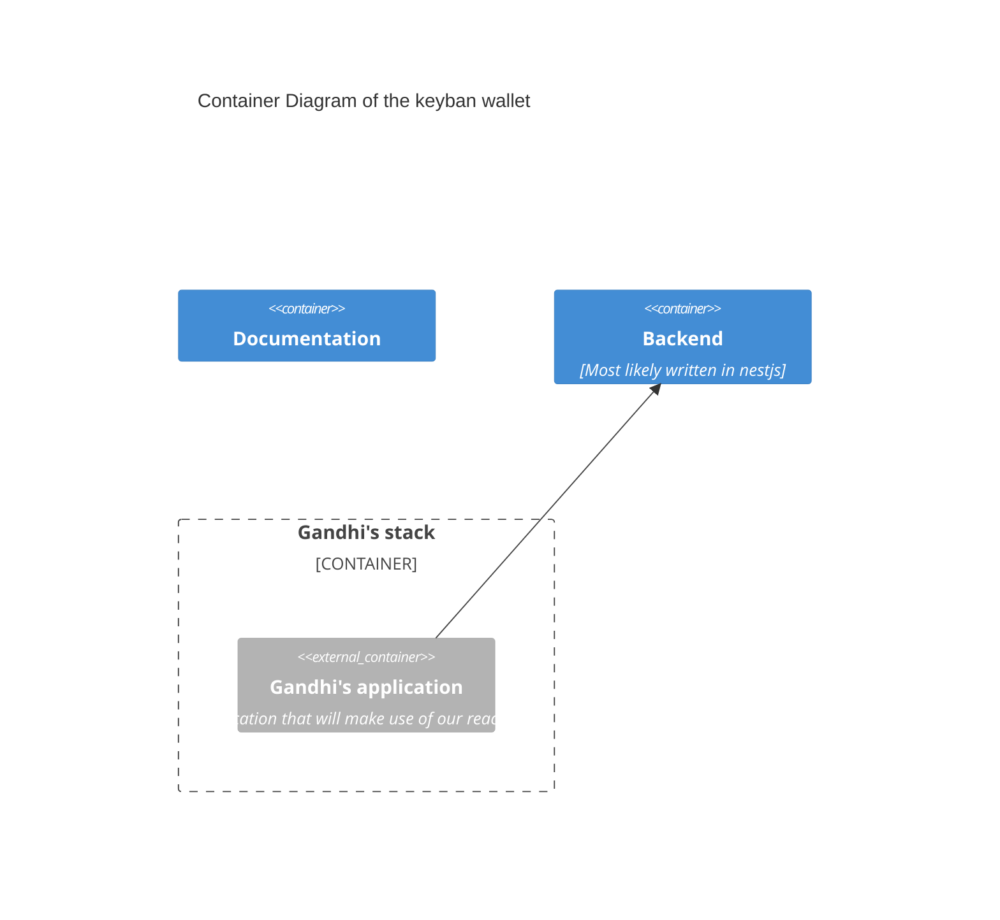
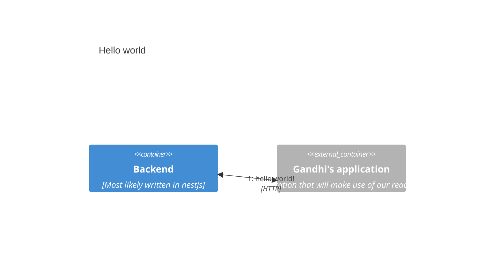
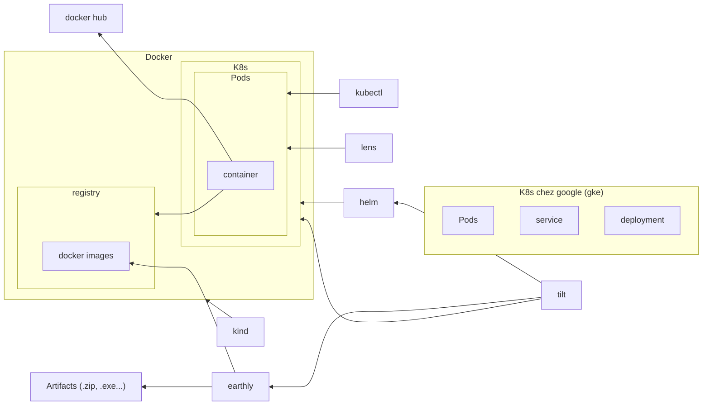

In here, we try to follow the [C4 model](https://c4model.com/) way of describing our product.

Those diagram are meant to show our stack and should be editing to reflect it at
any time.

[Container Diagram](https://c4model.com/#ContainerDiagram)
=================

[Dynamic diagram](https://c4model.com/#DynamicDiagram)
===============

[Deployment diagram](https://c4model.com/#DeploymentDiagram) in our local machines
====

