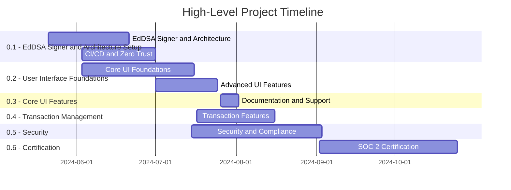
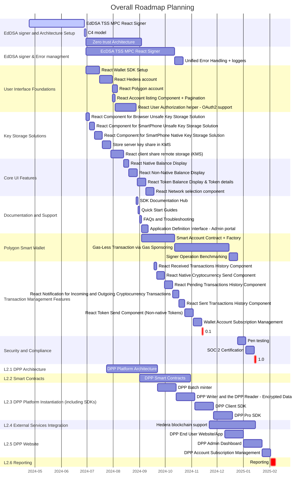

# Roadmap Planning

## High-Level Wallet Roadmap Planning



## Detailed Wallet Roadmap Planning

```mermaid
gantt
    title Detailed Wallet Roadmap Planning
    dateFormat  DD/MM/YYYY

    section 0.1 - EdDSA Signer and Architecture Setup
    EdDSA TSS MPC React Signer : 21/05/2024, 31/05/2024
    C4 model : 03/06/2024, 03/06/2024
    Deploy the CI/CD for testing : 04/06/2024, 01/07/2024
    Zero trust Architecture : 03/06/2024, 14/06/2024
    Unified Error Handling + loggers : 11/06/2024, 21/06/2024

    section 0.2 - User Interface Foundations 
    React Component for SmartPhone Native Key Storage Solution : 03/06/2024, 12/06/2024
    React Wallet SDK Setup : 13/06/2024, 28/06/2024
    React Hedera account : 17/06/2024, 01/07/2024
    React Account listing Component + Pagination : 24/06/2024, 28/06/2024
    React User Authorization helper - generic OAuth2 support - sdk + backend handling : 26/06/2024, 15/07/2024
    Store the server key share in a KMS : 01/07/2024, 16/07/2024
    Application Definition Interface - Admin portal : 08/07/2024, 12/07/2024
    Deploy the CI/CD per branch : 02/07/2024, 29/07/2024

    section 0.3 - Core UI Features
    React Native Balance Display + RPC node & indexer access : 01/07/2024, 04/07/2024
    React Non-Native Balance Display : 05/07/2024, 11/07/2024
    React Token Balance Display & Token details : 12/07/2024, 19/07/2024
    React Network selection component : 12/07/2024, 25/07/2024

    section 0.4 - Documentation and Support
    SDK Documentation Hub : 26/07/2024, 29/07/2024
    Quick Start Guides : 30/07/2024, 31/07/2024
    FAQs and Troubleshooting : 01/08/2024, 02/08/2024

    section 0.5 - Transaction Management Features
    React Received Transactions History Component : 22/07/2024, 26/07/2024
    React Native Cryptocurrency Send Component : 19/07/2024, 05/08/2024
    React Pending Transactions History Component : 30/07/2024, 30/07/2024
    React Notification for Incoming and Outgoing Cryptocurrency Transactions on Hedera : 17/07/2024, 16/08/2024
    React Sent Transactions History Component : 31/07/2024, 02/08/2024
    React Token Send Component (Non-native Tokens) : 29/07/2024, 13/08/2024
    Deploy the prod infra : 30/07/2024, 05/08/2024

    section 0.6 - Security and Compliance
    Signer Operation Benchmarking : 16/07/2024, 21/08/2024
    Pen testing : 15/07/2024, 30/08/2024
    Service SLA Features : 06/08/2024, 03/09/2024
    Real-Time Platform Status Page : 07/08/2024, 21/08/2024

    section 0.7 - SOC 2 Certification
    SOC 2 Certification : 02/09/2024, 25/10/2024
  ```

## DPP Roadmap

```mermaid
gantt
    title Overall Roadmap Planning
    dateFormat YYYY-MM-DD
    axisFormat %Y-%m
    
    section L2.1 DPP Architecture
    DPP Platform Architecture         :           b1, 2024-07-24, 60d
    
    section L2.2 Smart Contracts
    DPP Smart Contracts               :           b2, 2024-09-01, 60d
    
    section L2.3 DPP Platform Instantiation
    DPP Batch minter                  :           b4, 2024-09-22, 22d
    DPP Writer and the DPP Reader - Encrypted Data : b5, after b4, 22d
    DPP Client SDK                    :           b6, after b5, 22d
    DPP Pro SDK                       :           b7, after b6, 22d
    
    section L2.4 External Services Integration
    Hedera blockchain support         :           b3, 2024-11-22, 54d
    
    section L2.5 DPP Website
    DPP End User Website/App          :           b8, 2024-12-10, 22d
    DPP Admin Dashboard               :           b9, after b8, 22d
    DPP Account Subscription Management   :           b10, after b9, 10d
    
    section L2.6 Reporting
    Reporting: crit, after b10, 6d
```

## Overall Detailled Planning

