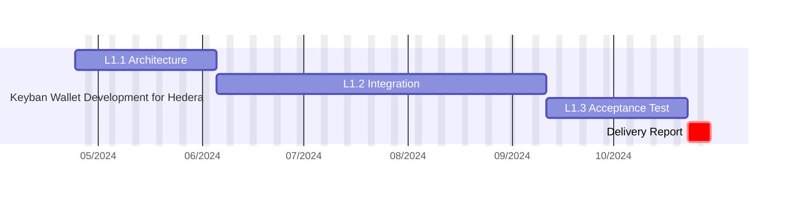
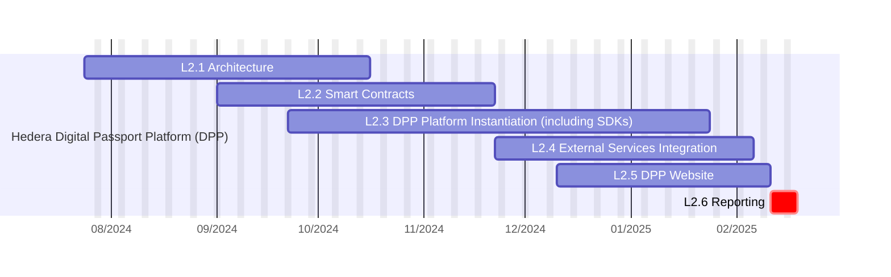
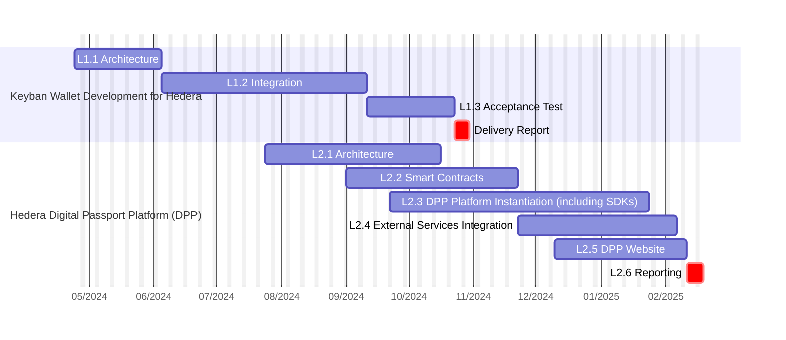

# Weavenn - Hedera <> Keyban Planning

## Wallet as a service SDK Team Composition

| Profil                   | Team mate                           |
| ------------------------ | ----------------------------------- |
| 1 Architect              | @Kei-Kiban,@Konubinix,@mvanmeerbeck |
| 1 Cryptography Developer | @ahmdssi                            |
| 1 React-Native Developer | @RadekKeyban                        |
| 1 Backend Developer      | @grepson-keyban                     |
| 1 DevOps                 | @new-team-mate-1                    |

## DPP Team Composition

| Profil                                  | Team mate        |
| --------------------------------------- | ---------------- |
| 1 Architect at 30% commitment           | @Kei-Kiban       |
| 1 React-Native Developer                | @RadekKeyban     |
| 1 Backend Developer                     | @grepson-keyban  |
| 1 DevOps at full-time                   | @new-team-mate-1 |
| 1 Web Developer at 50% commitment       | @mvanmeerbeck    |
| 1 Smart Contract Developer at full-time | @ahmdssi         |

# Overall Project Timeline

