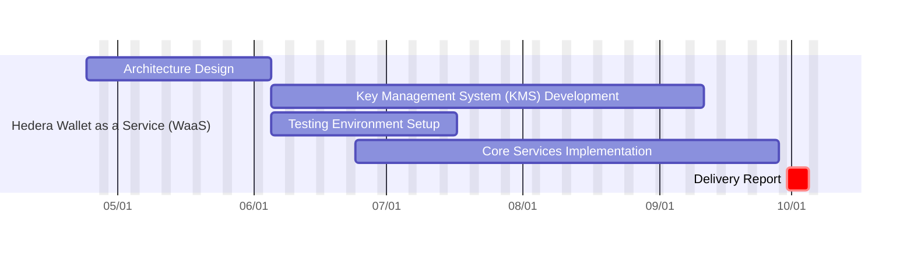
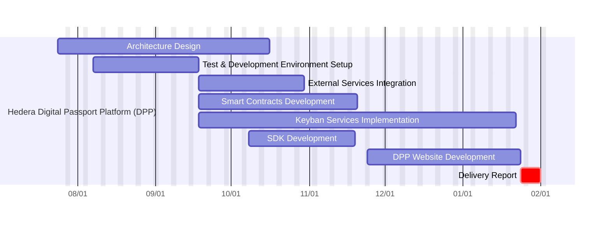
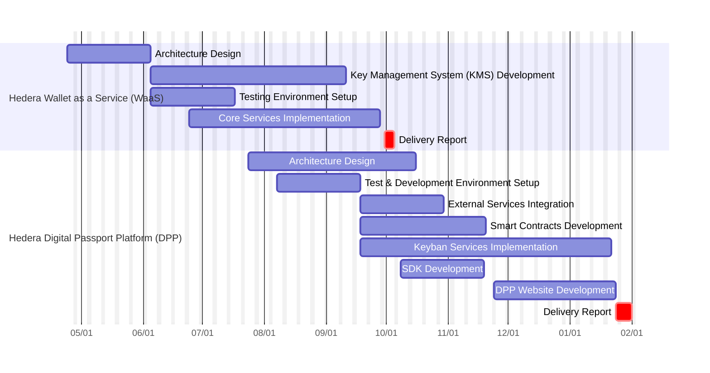

# Weavenn - Hedera <> Keyban Planning

## Wallet as a service SDK Team Composition

| Profil                   | Team mate                           |
| ------------------------ | ----------------------------------- |
| 1 Architect              | @Kei-Kiban,@Konubinix,@mvanmeerbeck |
| 1 Cryptography Developer | @ahmdssi                            |
| 1 React-Native Developer | @RadekKeyban                        |
| 1 Backend Developer      | @grepson-keyban                     |
| 1 DevOps                 | @Konubinix                          |

## DPP Team Composition

| Profil                                  | Team mate       |
| --------------------------------------- | --------------- |
| 1 Architect at 30% commitment           | @Kei-Kiban      |
| 1 React-Native Developer                | @RadekKeyban    |
| 1 Backend Developer                     | @grepson-keyban |
| 1 DevOps at full-time                   |                 |
| 1 Web Developer at 50% commitment       |                 |
| 1 Smart Contract Developer at full-time | @ahmdssi        |

# Overall Project Timeline

